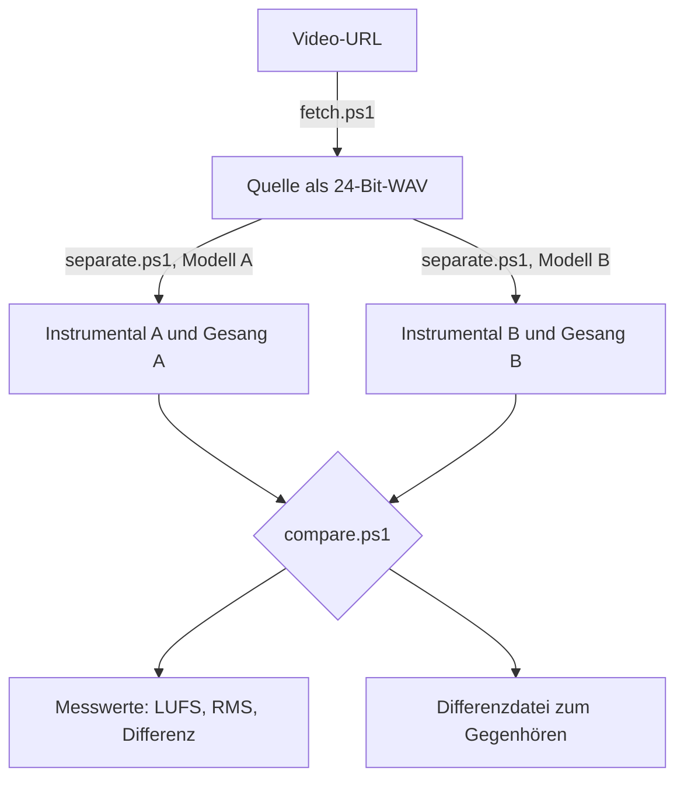

# audio-extraction

Gesang aus einem Song entfernen — lokal auf der eigenen GPU, in messbarer Qualität, ohne Upload und ohne laufende Kosten.


> [!NOTE]
> **Worum es geht.** Vier PowerShell-Skripte bilden die vollständige Kette ab: Umgebung einrichten, Quelle holen, Gesang und Instrumental trennen, Ergebnisse objektiv vergleichen. Das Werkzeug richtet sich an alle, die ein Instrumental oder eine A-cappella-Spur in hoher Qualität brauchen — für Karaoke, zum Üben, für Remixes oder zur Musikanalyse.
>
> **Was es besser macht.** Vergleichbare Onlinedienste liefern im Gratistarif 16 Bit, arbeiten mit Warteschlangen und verlangen den Upload des Materials. Hier bleibt alles lokal, die Ausgabe erfolgt in 32-Bit-Float, und ein Durchgang dauert Sekunden statt Minuten. Vor allem aber misst `compare.ps1`, ob sich zwei Ergebnisse überhaupt hörbar unterscheiden — statt dass du dich auf Benchmark-Tabellen verlassen musst.

## Inhalt

- [Warum lokal](#warum-lokal)
- [So läuft es ab](#so-läuft-es-ab)
- [Voraussetzungen](#voraussetzungen)
- [Schnellstart](#schnellstart)
- [Die Skripte](#die-skripte)
- [Parameterreferenz](#parameterreferenz)
- [Modellwahl](#modellwahl)
- [Ergebnisse](#ergebnisse)
- [Wenn Hallreste bleiben](#wenn-hallreste-bleiben)
- [Stolpersteine](#stolpersteine)
- [Was bewusst nicht im Repository liegt](#was-bewusst-nicht-im-repository-liegt)
- [Mitwirken](#mitwirken)
- [Rechtliches](#rechtliches)
- [Lizenz](#lizenz)

## Warum lokal

Ein 2:33 langer Track ist auf einer RTX 5080 in **3,8 Sekunden** verarbeitet; mit dem Laden des Modells dauert der gesamte Aufruf rund 9 Sekunden. Damit kippt die übliche Abwägung: Wenn ein Durchgang praktisch nichts kostet, ist das Durchprobieren mehrerer Modelle schneller als jede Vorabrecherche darüber, welches das beste sein soll.

Dazu kommen 32-Bit-Float-Ausgabe statt der 16 Bit, die Gratiskonten von Onlinediensten üblicherweise liefern, keine Warteschlange, keine Längen- oder Mengenbegrenzung, und das Material verlässt den eigenen Rechner nicht.

Ehrlich dagegengehalten: Das derzeit stärkste Modell auf MVSep, `BS Roformer 124 bands (ver. 2026.07)`, ist dort exklusiv und lokal nicht verfügbar. Die offenen Checkpoints liegen einige SDR-Zehntel darunter. Wer das letzte Zehntel braucht und den Upload nicht scheut, fährt dort besser.

## So läuft es ab

Die Kette ist bewusst als Vergleich angelegt: Zwei Modelle laufen über dieselbe Quelle, und `compare.ps1` beantwortet, ob der Unterschied hörbar ist.



## Voraussetzungen

| Anforderung | Einzelheiten |
|---|---|
| Python | 3.13 getestet, über den `py`-Launcher erreichbar. Ältere Versionen ab 3.10 sollten funktionieren, sind hier aber nicht geprüft. |
| ffmpeg | im PATH (`winget install Gyan.FFmpeg`) |
| PowerShell | 5.1 oder neuer, unter Windows vorinstalliert |
| GPU | NVIDIA mit 8 GB VRAM oder mehr empfohlen. CPU-Betrieb funktioniert, dauert aber ein Vielfaches. |
| Speicherplatz | rund 3 GB für PyTorch, dazu 0,2 bis 0,7 GB je Modell |

> [!IMPORTANT]
> Für RTX-50xx-Karten (Blackwell, `sm_120`) ist der PyTorch-Build entscheidend: Es braucht `cu128` oder neuer. Die Standard-Wheels von PyPI kennen diese Architektur nicht und fallen still auf die CPU zurück — die Trennung läuft dann, nur eben zehn- bis fünfzigmal langsamer. `setup.ps1` wählt den passenden Index selbst und meldet am Ende, ob CUDA tatsächlich greift. Diese Ausgabe lohnt einen Blick.

## Schnellstart

```powershell
git clone https://github.com/muraschal/audio-extraction.git
cd audio-extraction
.\scripts\setup.ps1
```

Danach die Quelle holen und trennen:

```powershell
.\scripts\fetch.ps1 -Url "https://youtu.be/XXXXXXXXXXX" -Name "song"
.\scripts\separate.ps1 -Path ".\input\song.wav"
```

Die Stems liegen anschliessend in `output\bs_roformer_voc_hyperacev2\`.

Ein zweites Modell zum Gegenvergleich, danach die Messung:

```powershell
.\scripts\separate.ps1 -Path ".\input\song.wav" -Model model_bs_roformer_ep_317_sdr_12.9755

.\scripts\compare.ps1 -Files @(
    ".\output\bs_roformer_voc_hyperacev2\song_instrument.wav",
    ".\output\model_bs_roformer_ep_317_sdr_12.9755\song_Instrumental.wav"
) -WriteDiff ".\output\diagnose"
```

## Die Skripte

### `setup.ps1`

Legt die venv an und installiert yt-dlp, PyTorch und pymss. Erkennt die GPU und wählt den passenden PyTorch-Index; ohne NVIDIA-Karte den CPU-Build. Prüft zum Schluss, ob CUDA tatsächlich greift.

### `fetch.ps1`

Lädt die höchstbitratige Tonspur und erzeugt daraus eine 24-Bit-WAV. Mit `-ListFormats` siehst du vorher, was zur Auswahl steht.

Zur Quelle: Die Umwandlung nach WAV stellt nichts wieder her, sie verhindert nur weitere Verluste in der Kette. Wo eine gekaufte WAV oder FLAC existiert, ist sie der bessere Ausgangspunkt — und zwar mit deutlichem Abstand. Der Unterschied zwischen 140-kbps-Opus und einer verlustfreien Quelle wiegt im Endergebnis schwerer als der zwischen zwei Trennungsmodellen.

### `separate.ps1`

Ruft pymss auf und legt die Stems in einem nach Modell benannten Unterordner ab, sodass sich mehrere Modelle nebeneinander vergleichen lassen.

Ausgabe ist 32-Bit-Float-WAV. Das ist kein Selbstzweck: Getrennte Stems überschreiten regelmässig 0 dBFS, weil ihre Summe lauter sein kann als das Original. Float hält diese Werte fest, 16 oder 24 Bit würden clippen.

### `compare.ps1`

Misst Format, Lautheit und RMS jeder Datei und bildet für jedes Paar das Differenzsignal.

Der Differenz-RMS ist die eigentlich nützliche Zahl. Er beantwortet, wie weit sich zwei Versionen überhaupt unterscheiden. Liegt die Differenz 40 dB oder mehr unter dem Signalpegel, ist der Unterschied nicht hörbar und die aufwendigere Variante verschenkte Rechenzeit. Bei 25 bis 30 dB darunter lohnt das Gegenhören.

Mit `-WriteDiff` landet das Differenzsignal um 20 dB angehoben als FLAC auf der Platte. Was darin zu hören ist, ist exakt das, worüber die beiden Modelle uneins sind — meist Hallfahnen und Zischlaute. Das ist der schnellste Weg zur Entscheidung, viel schneller als den ganzen Song zweimal durchzuhören.

### `_common.ps1`

Kein eigenständiges Skript, sondern gemeinsame Hilfsfunktionen. Enthält vor allem `Invoke-Native`, das die Aufrufe externer Programme kapselt — siehe [Stolpersteine](#stolpersteine).

## Parameterreferenz

Jedes Skript trägt vollständige Hilfe im Kopf. Die ausführliche Fassung mit allen Beschreibungen und Beispielen erreichst du so:

```powershell
Get-Help .\scripts\separate.ps1 -Full
```

### `setup.ps1`

| Parameter | Vorgabe | Bedeutung |
|---|---|---|
| `-VenvPath` | `.venv` | Zielpfad der virtuellen Umgebung |
| `-TorchIndex` | automatisch | Überschreibt den GPU-abhängig gewählten PyTorch-Index, etwa `https://download.pytorch.org/whl/cpu` |

### `fetch.ps1`

| Parameter | Vorgabe | Bedeutung |
|---|---|---|
| `-Url` | **erforderlich** | Video-URL, aus der die Tonspur geholt wird |
| `-OutDir` | `input\` | Zielordner |
| `-Name` | Videotitel | Basisname der Zieldatei ohne Endung |
| `-FormatId` | `bestaudio` | Erzwingt eine bestimmte yt-dlp-Format-ID |
| `-ListFormats` | aus | Listet nur die Audioformate auf und lädt nichts |

### `separate.ps1`

| Parameter | Vorgabe | Bedeutung |
|---|---|---|
| `-Path` | **erforderlich** | Eingangsdatei oder -ordner |
| `-Model` | `bs_roformer_voc_hyperacev2` | pymss-Modellname |
| `-OutDir` | `output\<Modell>\` | Ausgabeordner |
| `-Tta` | aus | Test-Time-Augmentation; verdreifacht die Rechenzeit |
| `-Format` | `wav` | `wav`, `flac`, `mp3` oder `m4a` |
| `-Device` | `auto` | `auto`, `cuda`, `cpu`, `mps` oder `mlx` |

### `compare.ps1`

| Parameter | Vorgabe | Bedeutung |
|---|---|---|
| `-Files` | **erforderlich** | Zwei oder mehr zu vergleichende Audiodateien |
| `-WriteDiff` | aus | Ordner für die Differenzdateien; ohne Angabe wird nur gemessen |

Alle Skripte enden mit Exit-Code 0 bei Erfolg. Schlägt ein externes Programm fehl, bricht das Skript mit dessen Exit-Code in der Fehlermeldung ab.

## Modellwahl

Die vollständige Liste zeigt pymss selbst. Die venv wird dabei nicht aktiviert, der Aufruf geht direkt auf die ausführbare Datei:

```powershell
.\.venv\Scripts\pymss.exe list
```

Das sind über 200 Modelle. Für Gesangsentfernung sind diese der sinnvolle Einstieg:

| Modell | Grösse | Anmerkung |
|---|---|---|
| `bs_roformer_voc_hyperacev2` | 289 MB | guter Standard, schnell |
| `model_bs_roformer_ep_317_sdr_12.9755` | 639 MB | bekannter starker Checkpoint |
| `model_bs_roformer_ep_368_sdr_12.9628` | 639 MB | Alternative zum Gegenhören |

Vier, fünf oder sechs Stems zu erzeugen bringt für diesen Zweck nichts. Mehr Stems bedeuten nicht automatisch ein saubereres Instrumental — sie bedeuten nur mehr Dateien.

## Ergebnisse

Gemessen, nicht übernommen — Einzelheiten in [docs/messungen.md](docs/messungen.md):

- **TTA lohnte sich nicht.** Mit und ohne Test-Time-Augmentation unterschieden sich die Ergebnisse um 47 dB unter Signalpegel, also unhörbar, bei dreifacher Rechenzeit.
- **Die Modellwahl wog schwerer, blieb aber überschaubar.** Zwei BS-RoFormer-Modelle divergierten um 26 dB unter Signalpegel. Hörbar beim konzentrierten Vergleich, kein Unterschied zwischen brauchbar und unbrauchbar.
- **Alle Modelle rechnen intern mit 44,1 kHz.** Eine 48-kHz-Quelle wird also neu abgetastet. Das ist modellbedingt und liesse sich auch auf MVSep nicht umgehen.

## Wenn Hallreste bleiben

Trockener Hauptgesang lässt sich sehr gut entfernen. Schwieriger sind Vocal-Hall und Delay, weil sie klanglich bereits Teil des Instrumentals geworden sind.

Der übliche Rat lautet, dafür SpectraLayers oder iZotope RX zu kaufen. Das ist oft nicht nötig: pymss bringt eigene Dereverb-Modelle mit, die auf dem fertigen Instrumental in denselben Sekunden laufen.

```powershell
.\scripts\separate.ps1 `
    -Path ".\output\bs_roformer_voc_hyperacev2\song_instrument.wav" `
    -Model dereverb_bs_roformer_anvuew_sdr_22.5050
```

> [!TIP]
> Der Durchgang liefert zwei Dateien: `song_instrument_noreverb.wav` und `song_instrument_reverb.wav`. Weiterverwenden willst du die erste — die zweite enthält nur den herausgelösten Hall und dient zum Prüfen, ob dabei zu viel mitgegangen ist.

Erst wenn danach noch einzelne Silben stören, lohnt ein spektraler Editor — und dann für die betroffenen Sekunden, nicht für den ganzen Song. Den gesamten Titel aggressiver zu trennen kostet Becken, Synthesizer und Snare.

## Stolpersteine

Sechs Dinge, die beim Aufbau Zeit gekostet haben und in den Skripten bereits berücksichtigt sind:

**PowerShell 5.1 liest `.ps1`-Dateien ohne BOM in der ANSI-Codepage.** Ein Skript mit Umlauten braucht deshalb zwingend ein UTF-8-BOM (`EF BB BF`), sonst kommen die Zeichen falsch an. Das bleibt selten bei blossem Schönheitsfehler: Ein Geviertstrich wird als ANSI zu einem typografischen Anführungszeichen, das PowerShell als String-Ende liest — die Datei parst dann gar nicht mehr. Für Markdown gilt das nicht, dort ist UTF-8 ohne BOM richtig.

> [!WARNING]
> Aus demselben Grund lassen sich Umlaute nicht zuverlässig per PowerShell-Skript in Dateien ersetzen. Liest ein solches Skript sein eigenes Ersetzungsmuster als ANSI, schreibt es doppelt kodiertes UTF-8 (`ü` statt `ü`). Das rückgängig zu machen ist verlustbehaftet, weil Windows-1252 und ISO-8859-1 sich im Bereich 0x80–0x9F unterscheiden — genau dort, wo Ä, Ö und Ü landen.

**stderr ist in PowerShell 5.1 kein Fehler, wird aber als solcher behandelt.** Der grösste Fallstrick. Sobald der Ausgabestrom eines nativen Programms umgeleitet wird, verpackt PowerShell jede stderr-Zeile in einen ErrorRecord und setzt `$?` auf false. Unter `$ErrorActionPreference = 'Stop'` bricht das Skript dadurch ab, obwohl das Programm mit Exit-Code 0 endet. Das trifft hier alle drei Werkzeuge: ffmpeg schreibt sämtliche Messwerte nach stderr, pymss die Fortschrittsanzeige, yt-dlp gelegentliche Warnungen. `Invoke-Native` in `_common.ps1` kapselt das an einer Stelle und wertet allein `$LASTEXITCODE` aus.

**`--print` schaltet yt-dlp in den Simulationsmodus.** Metadaten abfragen und herunterladen in einem Aufruf zu kombinieren führt dazu, dass gar nichts geschrieben wird — ohne Fehlermeldung. Deshalb sind es in `fetch.ps1` zwei getrennte Aufrufe.

**Jedes Modell benennt seine Stems anders.** `hyperacev2` schreibt `_instrument`, `ep317` dagegen `_Instrumental`, die Dereverb-Modelle `_noreverb` und `_reverb`. Fest verdrahtete Dateinamen laufen ins Leere; `separate.ps1` listet den Ausgabeordner deshalb am Ende auf, statt zu raten.

**`Diff` ist in PowerShell ein Alias für `Compare-Object`.** Eine eigene Funktion dieses Namens greift nicht, der Aufruf landet stattdessen bei `Compare-Object`.

**`Select-String` liefert ein `MatchInfo`-Objekt, keinen String.** Ohne `.Line` scheitert jede Zeichenkettenoperation darauf.

## Was bewusst nicht im Repository liegt

Der `.gitignore` folgt dem Allowlist-Prinzip: erst wird alles ignoriert, dann werden gezielt Skripte, Dokumentation und Lizenz wieder zugelassen. Bei einer gewöhnlichen Deny-Liste wäre jede neu entstehende Datei standardmässig committet — hier ist es umgekehrt.

Draussen bleiben damit Audiodateien und Stems, die venv mit rund 3 GB, sowie die Modell-Checkpoints, die ohnehin beim ersten Lauf automatisch geladen werden. Bei einem öffentlichen Repository ist die Allowlist die richtige Richtung.

## Mitwirken

Aufbau der Umgebung, Prüfschritte vor einem Pull Request und die Konventionen
des Projekts stehen in [CONTRIBUTING.md](CONTRIBUTING.md). Was sich zwischen
den Versionen geändert hat, führt [CHANGELOG.md](CHANGELOG.md).

## Rechtliches

Das Schweizer Urheberrecht erlaubt Privatgebrauch im persönlichen Kreis, einschliesslich Familie und engen Freunden. Eine bearbeitete Instrumentalfassung zu veröffentlichen, weiterzuverbreiten, öffentlich aufzuführen oder kommerziell zu nutzen erfordert dagegen in aller Regel die Erlaubnis der Rechteinhaber.

Dieses Repository enthält Werkzeuge, kein Audiomaterial. Keine Rechtsberatung.

## Lizenz

MIT — siehe [LICENSE](LICENSE).

Die verwendeten Modelle und Bibliotheken stehen unter eigenen Lizenzen. Insbesondere ist [pymss](https://pypi.org/project/pymss/) davon unabhängig lizenziert; die Modell-Checkpoints stammen aus der Music-Source-Separation-Community und haben jeweils eigene Nutzungsbedingungen.
